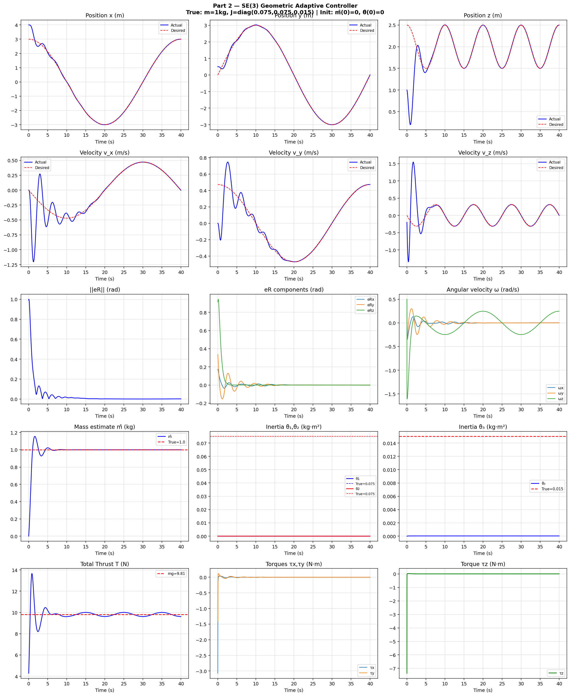
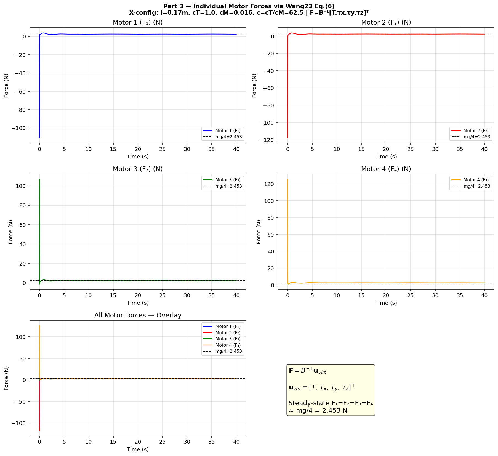
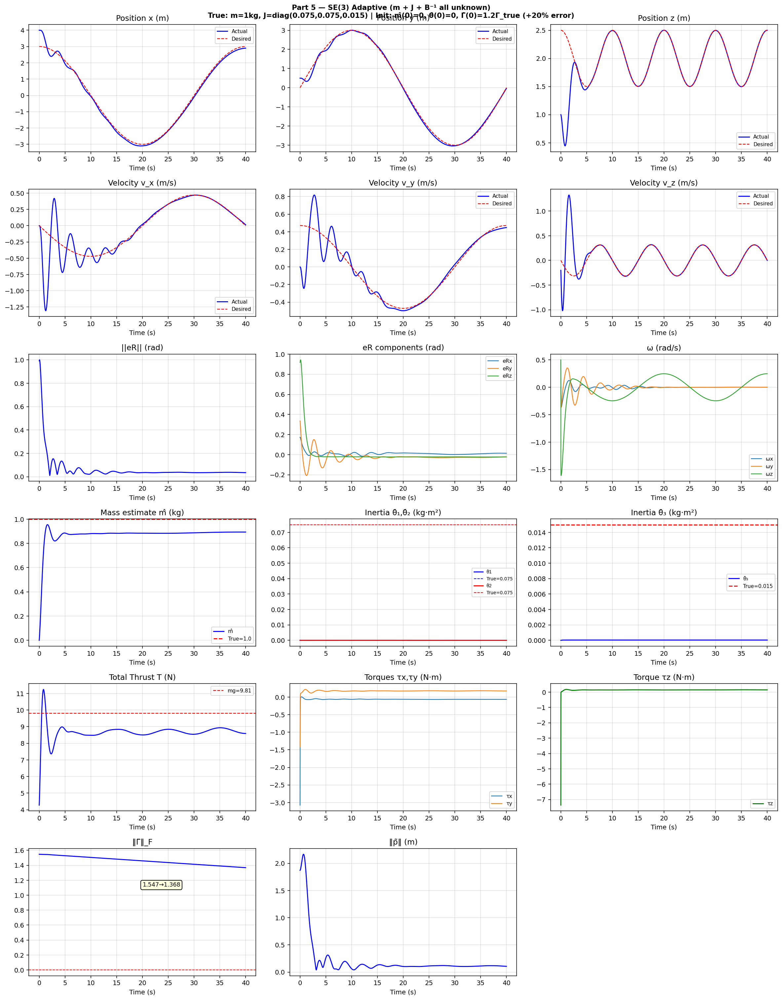
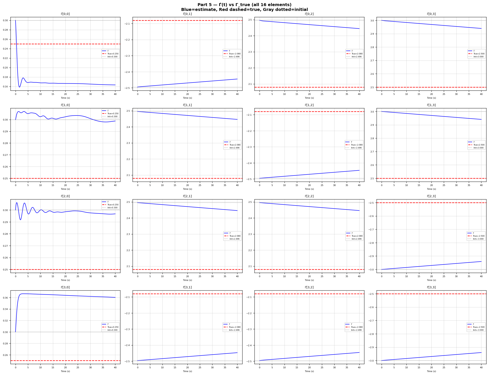

# Adaptive Control of a Quadrotor UAV with Uncertain Mass, Inertia, and Control Allocation

A complete adaptive geometric controller for quadrotor trajectory tracking on SE(3),
built up in three stages: known dynamics parameters, known control allocation, and
finally a fully parameter-adaptive controller that estimates mass, inertia, *and* the
motor control-allocation matrix online — all with a single unified Lyapunov proof
covering translational and rotational dynamics simultaneously.

Working directly with rotation matrices (rather than quaternions or Euler angles) avoids
both the unwinding phenomenon and the representation singularities associated with those
parameterizations, at the cost of needing periodic re-orthogonalization of `R` during
numerical integration.

## Problem Setup

Rigid-body quadrotor dynamics on SE(3):

```
ṗ = v
m v̇ = T R z_i - m g z_i
Ṙ = R Ω̂
J Ω̇ = τ - Ω × JΩ
```

with position `p`, velocity `v`, rotation `R ∈ SO(3)`, body angular velocity `Ω`, total
thrust `T`, body torque `τ`, and unknown constant parameters `m` (mass) and
`J = diag(θ₁, θ₂, θ₃)` (inertia).

The controller is a two-loop cascade — an outer position loop and an inner attitude
loop — coupled through a reference angular velocity term that enables a single combined
Lyapunov function for the whole system, rather than a cascade-stability argument.

## What's Implemented

| Part | Problem | Approach |
|------|---------|----------|
| 1 (theory) | Unified adaptive controller design | Composite Lyapunov function over position, velocity, attitude, angular-velocity, and parameter errors; exact cancellation of the translational–rotational coupling term via the reference angular velocity `Ω_r`; proof of asymptotic tracking (Theorem 1) |
| 2 | Simulation, known allocation | Full adaptive tracking of a helical reference trajectory with unknown mass and inertia (zero initial parameter estimates — the most adversarial case) |
| 3 | Motor-level control allocation | Wang et al. (2023) allocation matrix `B` maps thrust/torque to 4 motor forces; applies the known, invertible `B` to the Part 2 controller and plots individual motor forces |
| 4 (theory) | Unknown allocation matrix | Extends the adaptive framework to estimate `Γ = B⁻¹` online via a gradient law with σ-modification; proves uniform ultimate boundedness (Theorem 2) rather than asymptotic convergence, since exact cancellation is no longer available |
| 5 | Simulation, everything unknown | Mass, inertia, *and* the 16-entry allocation matrix are all estimated simultaneously online, starting from a 20% allocation-matrix offset; plots states, all three parameter estimates, and motor forces |

Each part in the accompanying report includes the full derivation and Lyapunov stability
proof, followed by simulation and quantitative discussion of the results.

## Results

**Part 2 — full adaptive tracking, known allocation.** Position, velocity, attitude
error, angular velocity, mass/inertia estimates, and control effort over a 40 s helical
trajectory, starting from zero parameter knowledge:



**Part 3 — individual motor forces via the known allocation matrix.** The large initial
yaw-torque demand from the 90° initial attitude error is amplified ~62.5× by the
allocation matrix's weak drag-to-thrust coupling, producing a brief, sharp, asymmetric
spike across the four motors before settling to the symmetric hover equilibrium:



**Part 5 — full three-loop adaptive controller, everything unknown.** Same reference
trajectory and disturbance profile as Part 2, but now mass, inertia, and all 16 entries
of the allocation matrix are estimated online from a 20%-off initial allocation
estimate. Tracking degrades gracefully from asymptotic convergence to bounded
(UUB) tracking error, exactly as predicted by Theorem 2:



**Part 5 — allocation matrix convergence.** All 16 entries of the estimated inverse
allocation matrix versus their true values; convergence rate differs sharply by column
depending on how persistently each channel (thrust, roll, pitch, yaw) is excited by the
reference trajectory:



## Notable Implementation Details

- **Unified vs. cascaded Lyapunov analysis:** The core theoretical contribution is a
  single composite Lyapunov function spanning both the translational and rotational
  error dynamics, with a coupling term in the reference angular velocity `Ω_r` chosen
  specifically to make the cross-term between the two subsystems cancel exactly in the
  Lyapunov derivative. This avoids weaker cascade-stability arguments common in simpler
  treatments.
- **Sign convention pitfall:** The rotation-matrix attitude error convention used here
  (`e_Ω = Ω − Ω_r`, actual minus reference) requires *negative* feedback gains in the
  control law. Using the positive-gain convention common in quaternion-based papers with
  the opposite error sign produces positive feedback and immediate numerical divergence.
  This was the root cause of early implementation failures and is documented in the
  report's Appendix B.
- **Persistence of excitation, twice over:** Mass estimation converges to the true value
  because the helical reference trajectory persistently excites the translational
  regressor. Inertia estimation does *not* converge, because the trajectory only
  involves gentle roll/pitch excursions and never excites the attitude regressor's
  cross-coupling terms — this is shown analytically and confirmed in simulation.
  The same story repeats one level up in Part 5: the allocation matrix's thrust column
  converges quickly (thrust is persistently and strongly excited by gravity
  compensation) while the yaw column converges slowest (yaw torque demand is small and
  only weakly, slowly time-varying).
- **Parameter coupling side effect (Part 5):** With an over-estimated allocation matrix,
  the vehicle receives more thrust than commanded, which the mass adaptive law
  misattributes to the vehicle being lighter than it actually is — converging to
  `m̂ ≈ 0.89 kg` instead of `1.0 kg`. This is a genuine, reasoned-through coupling effect
  between two simultaneously-active adaptive loops sharing the thrust channel, not a
  simulation bug, and is explained in detail in the report.
- **σ-modification for boundedness without PE:** Since the allocation matrix estimate
  cannot be guaranteed persistently excited in all 16 entries, a leakage term
  (σ-modification) is added to its adaptive law to guarantee bounded parameter
  estimates regardless of excitation, at the cost of exact convergence — trading
  asymptotic stability for uniform ultimate boundedness (Theorem 2).

## Repository Structure

```
├── adaptive_quadrotor_control.ipynb   # Full simulation code for Parts 2, 3, 5
├── report.pdf                         # Full report: theory (Parts 1, 4), derivations,
│                                       #   Lyapunov proofs, and simulation discussion
├── figures/                           # Key result plots (embedded above)
└── README.md
```

**Note on notebook output:** the notebook saves figures directly to disk (`savefig`)
rather than displaying them inline, so plots won't render in GitHub's notebook preview —
see the `figures/` folder or `report.pdf` for all results.

## Background

This was the final project for a graduate course in adaptive control, building on an
earlier assignment covering adaptive attitude-only control (rigid-body attitude
tracking with unknown inertia). The theoretical framework primarily follows and extends
Pliego-Jiménez (2021) for the coupled translational-rotational adaptive controller,
translated into rotation-matrix form, and Wang et al. (2023) for the motor control
allocation model.

Key references:
- J. Pliego-Jiménez, "Quaternion-based adaptive control for trajectory tracking of
  quadrotor unmanned aerial vehicles," *Int. J. Adapt. Control Signal Process.*, 2021.
- T. Lee, M. Leok, N. H. McClamroch, "Geometric tracking control of a quadrotor UAV on
  SE(3)," *IEEE CDC*, 2010.
- J. Wang, B. Zhu, Z. Zheng, "Robust adaptive control for a quadrotor UAV with uncertain
  aerodynamic parameters," *IEEE Trans. Aerosp. Electron. Syst.*, 2023.
- P. A. Ioannou, J. Sun, *Robust Adaptive Control*, Prentice-Hall, 1996 (σ-modification).
- M. Krstić, I. Kanellakopoulos, P. V. Kokotović, *Nonlinear and Adaptive Control
  Design*, Wiley, 1995 (LaSalle–Yoshizawa theorem).

Full reference list is in `report.pdf`.

## Requirements

```
numpy
matplotlib
```
